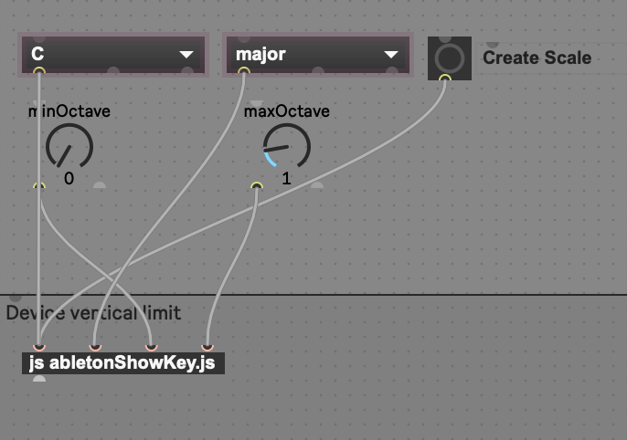

Max patch to setup the midi roll editor in ableton to only show the notes
that are in the key you choose.  

Download the files, install the amxd file (click on it) and then copy the javascript file
to the same directory as the amxd.

to use the patch, pull an instrument over, add the effect, select your options, click the create scale button, and then go to the midi roll for that instrument and click the "fold" button to show the notes of your scale. If you change anything, you just need to click the fold button twice to get it to refresh.

